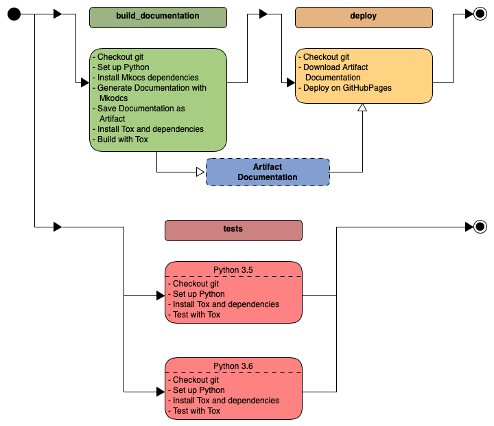

# ENSG TP: Continuous Integration Courses

School project of continuous integration.

---

This project aims to put in place an continuous integration system on the [mkdocs](https://github.com/mkdocs/mkdocs) project which information can be found on the following platforms:
- [GitHub Repository](https://github.com/mkdocs/mkdocs).
- View the [MkDocs documentation][mkdocs].
- Project [release notes][release-notes].
- Visit the [MkDocs wiki](https://github.com/mkdocs/mkdocs/wiki) for community
  resources, including third party themes and a list of MkDocs users.
- IRC channel: `#mkdocs` on freenode.
- Discussions and support: <https://groups.google.com/forum/#!forum/mkdocs>

## Description of the CI pipeline

The pipeline is built with the GitHub Action Integration system through a [configuration file](./.github/workflows/pythonpackage.yml). It is composed of three jobs:

1. Building job: `build_documentation` generate the documentation and package the project
    * Pulling the project in the VM of the job thanks to the GitHub Action `checkout@v1`
    * Installing the dependencies needed to create the documentation
    * Generating the documentation 
    * Uploading the documentation as an artifact thanks to the GitHub Action `upload-artifact@v1`
    * Installing Tox and the dependencies needed to package the project
    * Packaging the project with Tox
1. Testing job: `tests` runs tests in both Python 3.5 and 3.5 environments parallely
    * Pulling the project in the VM of the job thanks to the GitHub Action `checkout@v1`
    * Installing dependencies needed for running the project
    * Testing with tox 
1. Deploying job: `deploy` deploys the documentation on GitHub Pages
    * Pulling the project in the VM of the job thanks to the GitHub Action `checkout@v1`
    * Dowloading the documentation stored as artifacts thanks to the GithHub Action `download-artifact@v1`
    * Deploying on GitHub Pages thanks to the [JamesIves action](https://github.com/JamesIves/github-pages-deploy-action) `github-pages-deploy-action@releases/v3`

### Precisions:
* There are two parallel branches on the pipeline:
    * one for the building and the deploying jobs,
    * one for the testing job.
* The testing job has two parallel steps: if one of them fails, the other is cancelled.
* The deploying job needs a successful building job to start. So, if the building job fails, the deploying job is canceled but not the testing job.
* The status of the testing job has no impact on the deploying job:
    * because the deployement only consists on deploying the documentation.
    * that implies that the deploying job and the testing job can be runned simultaneously (as the deploying job starts when the building job is done).

[appveyor-image]: https://img.shields.io/appveyor/ci/d0ugal/mkdocs/master.svg
[appveyor-link]: https://ci.appveyor.com/project/d0ugal/mkdocs
[codecov-image]: https://codecov.io/github/mkdocs/mkdocs/coverage.svg?branch=master
[codecov-link]: https://codecov.io/github/mkdocs/mkdocs?branch=master
[landscape-image]: https://landscape.io/github/mkdocs/mkdocs/master/landscape.svg?style=flat
[landscape-link]: https://landscape.io/github/mkdocs/mkdocs/master
[pypi-v-image]: https://img.shields.io/pypi/v/mkdocs.svg
[pypi-v-link]: https://pypi.org/project/mkdocs/
[travis-image]: https://img.shields.io/travis/mkdocs/mkdocs/master.svg
[travis-link]: https://travis-ci.org/mkdocs/mkdocs

[mkdocs]: https://www.mkdocs.org
[release-notes]: https://www.mkdocs.org/about/release-notes/

[PyPA Code of Conduct]: https://www.pypa.io/en/latest/code-of-conduct/
